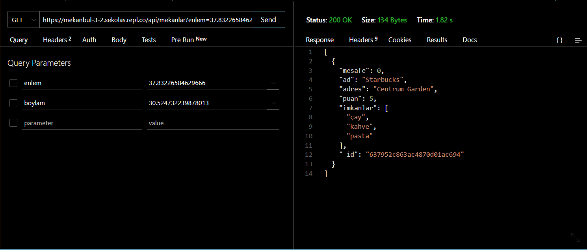
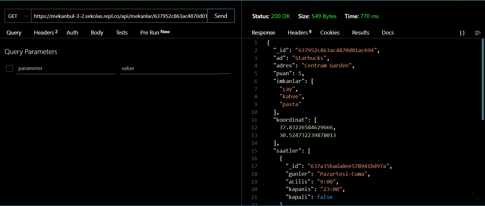
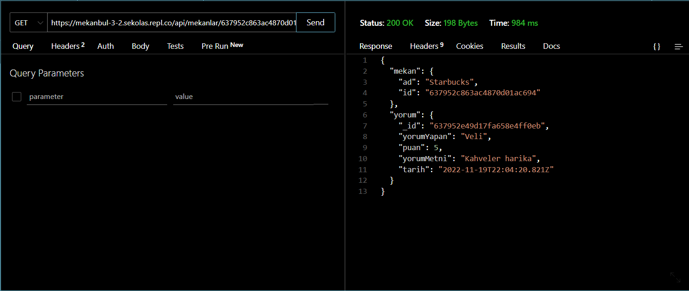

# MekanBul REST API TESTLERİ

### 1. Collection : MekanBul API Testleri

### 2. API Testleri

# Mekanbul Rest API dersleri
1.[Girilen Konum Civarındaki Mekanları Listele](https://mekanbul-3-2.sekolas.repl.co/api/mekanlar?enlem=37.83226584629666&boylam=30.524732239878013)

2.[Mekan ID ile mekan bilgilerini getir](https://mekanbul-3-2.sekolas.repl.co/api/mekanlar/637952c863ac4870d01ac694)

3.[Bir mekana ait belirli bir yorumu getir](https://mekanbul-3-2.sekolas.repl.co/api/mekanlar/637952c863ac4870d01ac694/yorumlar/637952e49d17fa658e4ff0eb)

